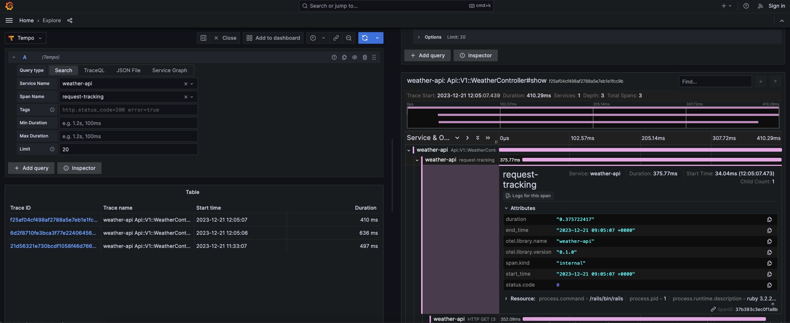

# Weather API + OpenTelemetry


This repository encompasses the code for a Ruby on Rails application that fetches weather information for the city of your preference and delivers it in a structured JSON format. The second facet of this undertaking revolves around the implementation of comprehensive monitoring mechanisms, employing OpenTelemetry, Prometheus, Grafana, and Tempo.

## Setup and run the application in development

The application is running on Docker, which implies that you need to set up Docker and Docker Compose on your machine. Before running the application, you will need to copy the environment variables from the `.env.example` file to the `.env` file.
```
cp .env.example .env
```
and fill the variables in `.env` file with your own values. After that run the application:

```
docker-compose up
```
Better way to run commands is to use command `make`. All aviable commands are listed in `Makefile` or `make help`. For example, to run tests run `make run_tests`, run rubocop `make run_rubocop` and so on.

# Weather API

Ruby on rails application uses [openweathermap.org](https://openweathermap.org) service API to get weather data. To use this service you need to register on [openweathermap.org](https://openweathermap.org/) and get your API key. After registration API keys will be aviable in [dashboard](https://home.openweathermap.org/api_keys).

### Request format
After start an application you can make 'GET' requests to the `/api/v1/weather` endpoint. In parameters you can pass city name. Example: `http://localhost:3000/api/v1/weather?city=London`.

### Success 200
In case of success response will be in JSON format.
```json
{
  "data": {
    "temp": -21.99,
    "feels_like": -28.99,
    "temp_min": -21.99,
    "temp_max": -21.99,
    "pressure": 1026,
    "humidity": 80,
    "sea_level": 1026,
    "grnd_level": 1025
  },
  "code": 200
}
```

### Error 404
In case city name is not found response will be in JSON format.
```json
{
  "message": "city not found",
  "code": "404"
}
```

### Error 406
In case city parameter is not present response will be in JSON format.
```json
{
  "message": "City must be present.",
  "code": 406
}
```

### Validations
In case of validation error response will be in JSON format.
- if city is blank
```json
{
  "message": "City must be present.",
  "code": 406
}
```
- if city is not valid (numbers and special characters in name)
```json
{
  "message": "City contains invalid characters.",
  "code": 406
}
```

### Change the provider for the weather
The service uses [openweathermap.org](https://openweathermap.org/) by default. To add another service and change it you should create a new service class like `OpenWeatherFetcher` in `service` folder and set in it method `call` to get weather data.

# Monitoring
This project is an example of how to use [Prometheus](https://prometheus.io/) and [Grafana](https://grafana.com/) to monitor your application. For collect metrics in application use [OpenTelemetry](https://opentelemetry.io/) library. In global view all metrics way looks like:
```
Application -> OpenTelemetry -> Tempo -> Prometheus -> Grafana
```
After run the appication in docker, Grafana dashboard will be available in [localhost:4000](http://localhost:4000). In final view, tracing of requests will be in Grafana dashboard.



Using [TraceQL](https://grafana.com/docs/tempo/latest/traceql/) Editor in Grafana dashboard you can see requests in Grafana dashboard, for example, list all requests with duration more than 20ms:
```
avg(duration) > 20ms
```

### OpenTelemetry integration
There are two ways to collect telemetry for application:
1. Use OpenTelemetry for separate methods ans requests. For example, there is class `PerformanceMonitor`. In controller we can write like this:
```ruby
performance_monitor = PerformanceMonitor.new
performance_monitor.track_request do
  render json: fetch_weather
end
```
2. Use middleware. In this case need to create the middleware class and write like this:
```ruby
class PerformanceMonitoringMiddleware
  def initialize(app)
    @app = app
    @performance_monitor = PerformanceMonitor.new
  end

  def call(env)
    @performance_monitor.track_request do
      @app.call(env)
    end
  end
end
```
In this case all requests will be tracked.

In that way it's possible to create custom perfomance metrics for your application and use them in any places in the application.

----------------------------------------
# Suggestions for improvement

- Incorporate authentication and authorization mechanisms within the application to prevent the misuse of API keys. This will also pave the way for a potential premium subscription model in the future. The most effective method for achieving this would be through the utilization of JWT.
- Add ability return data not only for city name, but also for other parameters, like coordinates, and add ability to change units measures (now it's `metrics`).
- Add ability to change the provider for the weather in GET request dinamically.
- Add ability to change the response format, not only JSON.
- Introduce Redis as a caching server. Currently, Rails cache is employed for caching, which is not the optimal choice for a production environment.
- It is advisable to enhance the application's metrics within the Grafana dashboard for production. This enables service monitoring, alert generation, and so forth. The incorporation of new metrics into the Grafana dashboard is a straightforward process that is contingent on the server infrastructure.
- It would be beneficial to establish a Continuous Integration process in Github using Actions, which would facilitate the automatic execution of Rubocop and Rspec tests following each pull request.
- Implement the collection of logs in Grafana using Loki.